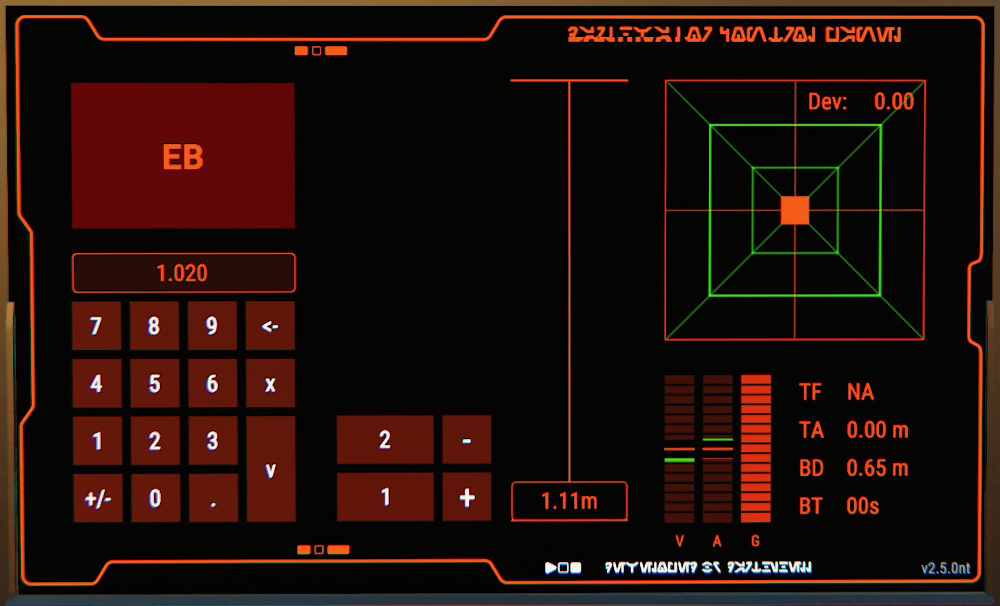
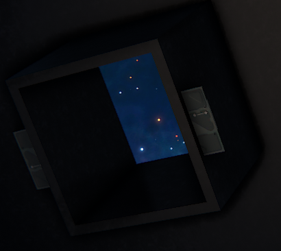
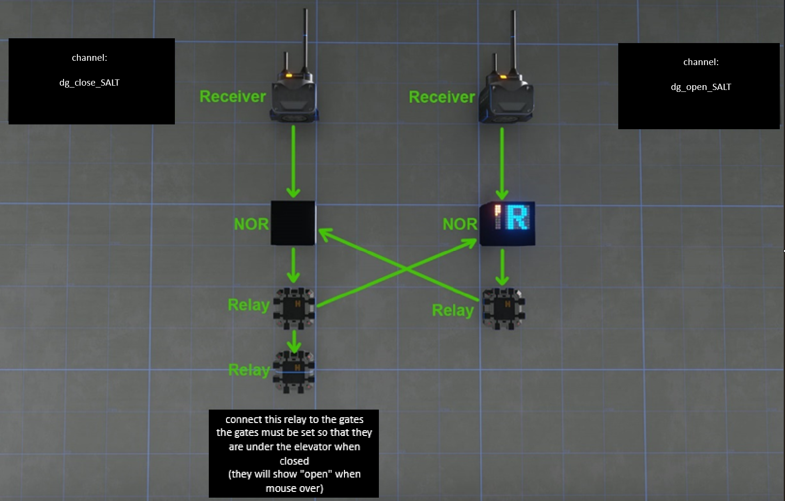

# License
GNU GENERAL PUBLIC LICENSE

Version 3, 29 June 2007

Copyright (C) 2007 Free Software Foundation, Inc. <https://fsf.org/>

- This software is released for use on NON-DRM constructs under the GNU General Public Licence.
- Under this licence, it may be used on NON-DRM constructs on the MMO DU server, and on private MyDU servers.
- This software is NOT licenced for use on DRM constructs, on any DU or MyDU server.

# Installation
## ship elements:
- __remote control__ __[necessary]__ _or any other control unit_
- __emergency control unit__ __[optional]__ _will help you with a cradle setup_
- __screen__ __[necessary]__
- __databank__ __[necessary]__
- __telemeter__ __[optional]__ _really helps with precise landing. Auto shutdown is not possible without_
- __emitter__ __[optional]__ _used for automatic docking_
- __radar__ __[optional]__ _use at your own risk bc of a wellknown radar bug_

__!__ all parts listed above should be linked before you aply autoconf

## autoconf
1. copy .conf file from repository to your __custom__ directory _Dual Universe\Game\data\lua\autoconf\custom_
2. link all elements to your control unit (order does not matter)
3. RMB on your control unit and use context menu __advanced->Update custom autoconf list__
4. RMB on your control unit and use context menu __advanced->Run custom autoconfigure -> Darthvator 1.0.0r__ _version number can be changed later_
5. Now you can activate control unit and follow instructions from the screen. Elevator will work in an __easy_setup__ mode.

- The first launch is important to be made properly. It should be done at the altitude you want it to be used from. It will store that altitude in databank. Script will also remember it's position and orientation. Elevation axis will be off of a gravity well so if you start it from a slope and don't have enough thrust to compensate deviation from gravity - it is your fault.

## Is it really hard to use _not an easy setup_
### EASY SETUP
- it's a default mode in which scripts's precision is based on a user's ability to align elevator by maneuver tool. In other words I will not guarantee it's proper work in easy setup mode. That mode usually used for a quick demonstration and simple use cases. This mode can be disabled via editing __lua parameters__ from the control unit context menu.
### NOT AN EASY SETUP
- it is not hard, trust me.
- to make a proper setup you will need a customer service script which you can find in repository files.
- #### How to:
    1. put a programming board, screen and adjustor next to the place where you want your elevator to be installed
    2. adjustor should be placed rigt in the center of a cradle (elevator pad or whatever you wish to use) You can place it at any relative altitude (usually under your elevator). it will repesent the point on a future elevation axis, so that axis will be calculated from the adjustor position. Keep in mind that bc of NQ "magic" there is an offset of 0.5 to the forward and to the right of adjustor's original position. Anyway it's not crucial and you can adjust adjustor's :) position later.
    3. copy __customer_service.json__ to clipboard
    4. paste code from clipboard into the programming board via context menu
    5. link adjustor to the programming board first, then link the screen
    6. once you activate the programming board it will paste three vectors into the screen, which you can copy and paste straight into the code or (which is better) paste them to the lua parameters via context menu.
    7. via context menu of your control unit, uncheck __easy setup__ in lua parameters

## !whatever setup you choose you have to make a proper first launch!
- in both easy and not easy setup modes you have to launch it from it's base position, so it will remember correct base altitude

## CRADLE
- for the cradle you can use __sliding doors__ of any size, but ensure yourself that at least one of them is able to cover your elevator's telemeter.
- cradle example:

    

- doors should be connected to the relay of a cradle logic
- example of a cradle logic

    

- there are two receivers which provide signal for a SR latch. Their channels should be set for a unique value. For that purpose we use channel "salt". Channel "salt" should be set in your elevator control's lua parameters and also used to name channels on your cradle's receivers with a pattern __dg_close_SALT/dg_open_SALT__ where SALT is your channel salt you set on elevator.